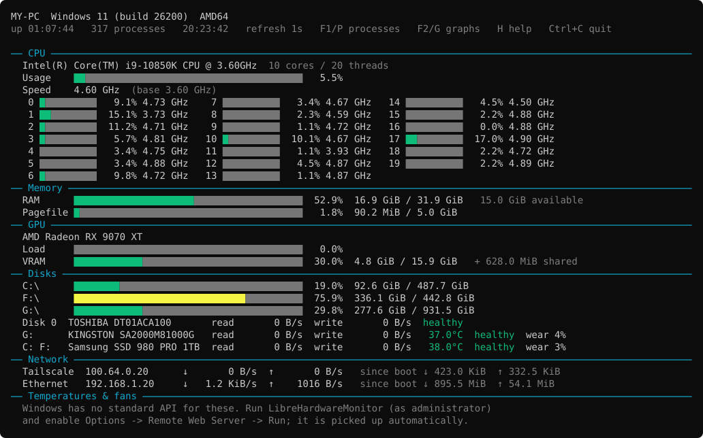

# sysmon

A live system monitor for the terminal that runs on **Windows and Linux**. It
detects the operating system at startup, picks the best data source available
on that platform, and redraws the screen in place once per second (or at the
interval you choose).

- **F1 / P** opens a process table you can sort, group by program, and end
  processes from.
- **F2 / G** opens usage graphs: overview, every CPU core, GPU, each disk and
  network adapter, and temperatures, over 1 to 60 minutes.
- **H** shows all keys.
- `--log` records every update to a CSV file, `--json` prints one snapshot for
  other scripts, and `sysmon.ini` sets which sections show and their colors.
- `--connect` sends the live view to `sysmon_server.py`, which shows every
  connected machine on one web page and as JSON for monitoring tools,
  optionally behind a password and over HTTPS (see
  [Remote monitoring](#remote-monitoring)).



## Requirements

- **Python 3.8 or newer; 3.11 or newer is recommended.**
- [psutil](https://pypi.org/project/psutil/), the only required package

Optional, for extra data:

| Optional tool | Platform | Adds |
|---|---|---|
| `nvidia-smi` (ships with the NVIDIA driver) | Windows, Linux | NVIDIA GPU load, VRAM, temperature, fan, power, clock |
| [LibreHardwareMonitor](https://github.com/LibreHardwareMonitor/LibreHardwareMonitor) | Windows | Temperatures, fan speeds and CPU power (see [below](#temperatures-fans-and-cpu-power-on-windows)) |
| `lm-sensors` | Linux | Loads the kernel drivers for motherboard sensor chips |
| `smartmontools` (`smartctl`) | Linux, as root | Disk health and wear |
| `lspci` (package `pciutils`) | Linux | Full GPU model names |

## Installation

```bash
pip install -r requirements.txt
```

The [remote monitoring server](#remote-monitoring), `sysmon_server.py`, needs
only Python: it doesn't use psutil.

## Usage

```bash
python sysmon.py
```

| Key | Action |
|---|---|
| **F1** or **P** | Show or hide the [process table](#process-table-f1--p) |
| **F2** or **G** | Show or hide the [graphs](#graphs-f2--g) |
| **H** or **?** | Show all keys (any key closes the help) |
| **Ctrl+C** | Quit |

The panes open on the right. In a window narrower than 200 columns only one
fits, so opening one replaces the other; at 200 columns or more both show side
by side next to the system view. The script uses the terminal's alternate
screen, so your previous terminal contents come back when it exits.

### Options

| Option | Default | Description |
|---|---|---|
| `-i SECONDS`, `--interval SECONDS` | `1` | Time between updates. Decimals are allowed; the minimum is `0.1`. |
| `--once` | off | Collect for one interval, print a single snapshot and exit. |
| `--json` | off | Collect for one interval, print a single snapshot [as JSON](#logging-and-json) and exit. |
| `--log FILE` | off | Append every update to a [CSV file](#logging-and-json). |
| `--config FILE` | `sysmon.ini` next to the script | [Settings file](#settings-file). |
| `--connect IP:PORT` | off | Also send every update to a [`sysmon_server.py`](#remote-monitoring) at this address. A host name works in place of the IP. IPv4 only [for now](#ipv6). Can't be combined with `--once` or `--json`. |
| `--password PASSWORD` | the `SYSMON_PASSWORD` environment variable, or none | The server's [password](#password), if it has one |
| `--server-cert FILE` | off | Send over [HTTPS](#https), trusting only this certificate: a copy of the one the server was started with. |
| `--version` | | Show the version and exit. |
| `-h`, `--help` | | Show the help text. |

### Examples

Update twice per second:

```bash
python sysmon.py -i 0.5
```

Watch and record every update to a CSV file:

```bash
python sysmon.py --log usage.csv
```

Get the current numbers as JSON for another script:

```bash
python sysmon.py --json > snapshot.json
```

Show this machine on the web page of a server at 192.168.1.10:

```bash
python sysmon.py --connect 192.168.1.10:8765
```

## What it shows

| Section | Contents |
|---|---|
| Header | Hostname, OS and version, architecture, uptime, process count, current time, update interval, and with `--connect` whether the server is reachable |
| CPU | Model, core and thread count, total load, current clock speed with base (Windows) or max (Linux) clock, power draw (when available), load average (Linux), and load and clock for every logical core |
| Memory | RAM used / total / available, and swap (Linux) or page file (Windows) |
| GPU | Per GPU: name, load, VRAM used / total (plus shared system memory on Windows), and clock, temperature, fan and power where the source provides them |
| Disks | Space used on each mounted drive, and per physical disk: drive letters or device name and mount points, model, read / write speed, temperature, health and wear |
| Network | Every active interface with its IPv4 address, download / upload speed, and totals since boot |
| Battery | Charge, plugged-in state, estimated time left and wear (only on machines with a battery) |
| Temperatures & fans | Every temperature and fan sensor, grouped by chip |

Bars and values are colored by level. These are the default levels; they and
the colors can be changed in the [settings file](#settings-file):

| | Green | Yellow | Red |
|---|---|---|---|
| Load / usage | below 60 % | 60–85 % | 85 % and above |
| Temperature | below 60 °C | 60–80 °C | 80 °C and above |
| Battery charge | 50 % and above | 20–50 % | below 20 % |

Speeds (CPU load, disk and network rates, power) are calculated from the
difference between two consecutive updates, so the first values appear one
interval after starting.

### Disk details

| | Windows | Linux |
|---|---|---|
| Name | Drive letters, e.g. `C: H:` | Device and mount points, e.g. `nvme0n1 (/, /home)`; LUKS / LVM volumes are traced to their disks |
| Model | Storage driver | `/sys/block/<disk>/device/model` |
| Temperature | NVMe: health log; other drives if their driver reports it | Kernel hwmon (NVMe; SATA with the `drivetemp` module) |
| Health | NVMe: `healthy` unless the drive reports a critical warning; other drives: SMART failure prediction | `smartctl`, as root |
| Wear | NVMe: "percentage used" | NVMe, from `smartctl` |

None of the Windows queries need administrator rights.

## Process table (F1 / P)

```
Processes by CPU
↑↓ select  ←→ sort  A group  K end  P hide

      PID Name                     ▼CPU     Memory    GPU       VRAM
    36116 destiny2.exe             6.9%    3.8 GiB  16.6%    1.2 GiB
    20200 LeagueClient.exe         2.8%  526.7 MiB   0.0%        0 B
    29932 zen.exe                  1.4%   46.9 MiB   4.4%    4.9 GiB
```

| Column | Measures |
|---|---|
| CPU | Share of the **whole** CPU (all cores), so it adds up with the total usage bar |
| Memory | Private working set on Windows (Task Manager's "Memory" column), resident memory (RSS) on Linux |
| GPU | The process's busiest GPU engine, like Task Manager's "GPU" column |
| VRAM | Dedicated GPU memory the process uses |
| I/O | Bytes read + written per second. On Windows this includes all I/O (disk, network, devices), on Linux only storage I/O |
| Network | Bytes sent + received per second (needs [admin / root](#running-as-administrator-or-root)) |

| Key | Action |
|---|---|
| **↑ / ↓** | Select a process. The selection stays on the same process while the table re-sorts. |
| **← / →** | Sort by another column (marked `▼`) |
| **A** | Group by program: one row per program name, adding up its processes, like Task Manager's app groups (GPU use is capped at 100 %). Press again to ungroup. |
| **K** or **Delete** | End the selected process, or every process of the selected program. Asks first: **Y** ends it, any other key cancels. |

- The table fills the window height. Processes using less than 0.1 % of the
  sorted resource are left out: 0.1 % of the CPU, the GPU, the RAM or the VRAM,
  and for I/O and network 0.1 % of what all processes use together.
- The sort column always shows; the other columns show as the pane's width
  allows.
- CPU, I/O and network are rates, so right after the table opens they show
  `measuring...` for one update. Nothing is collected while the table is closed.
- Ending a process sends it a normal termination request (SIGTERM on Linux,
  TerminateProcess on Windows). On Linux this **needs root** (start sysmon with
  `sudo`). On Windows, system processes and other users' processes answer
  "access denied" unless sysmon runs as administrator.
- The process is identified when you press **K**, including when it started. If
  it exits before you press **Y** and the system gives its process ID to a new
  process, that new process is left alone. If it has already exited when you
  press **K**, the table says it has already ended.

## Graphs (F2 / G)

| Key | Action |
|---|---|
| **Tab** | Next page |
| **+ / -** | Longer / shorter time span: 1, 5, 15 or 60 minutes |

| Page | Graphs | Scale |
|---|---|---|
| Overview | CPU, memory, each GPU's load, disk read + write, network download and upload | % graphs: 0–100 %; disk: automatic; network: [log scale](#network-graphs) |
| CPU cores | Every logical core | 0–100 % |
| GPU | Each GPU's load and VRAM use | 0–100 % |
| Disks | Each physical disk's read and write speed | Automatic |
| Network | Each adapter's download and upload speed | [Log scale](#network-graphs) up to the adapter's link speed |
| Temperatures | Every temperature sensor, GPU and disk | 0–100 °C (higher if exceeded) |

```
── CPU 31.6% ──────────────────────────────────────────────


                                                     ▄  █▄▄
                                                 ██▄███████
── Disk read + write 0 B/s   peak 111.5 MiB/s ─────────────
                                             █
                                            ▄█   ▄
                                            ██   █
                                            ██ ▄ █
```

- Newest values are on the right. Each column averages the updates in its slice
  of the time span.
- Titles show the current value. Disk graphs also show the peak on screen, which
  sets their scale (at least 1 KiB/s).
- Pages with more than 6 graphs (CPU cores, often temperatures) show two
  smaller graphs per row.
- % graphs are colored per column by level, temperature graphs by temperature,
  and rate graphs in the accent color.
- History is recorded from the moment the script starts, even while the graphs
  are closed, and an hour is kept.
- On Linux the graphs rise in eighths of a character (`▁▂▃▄▅▆▇█`). On Windows
  they use half steps (`▄█`), because the classic console fonts (Consolas,
  Lucida Console) have no other steps.

### Network graphs

Network traffic ranges from a few bytes to over 100 MiB per second, so network
graphs use a **logarithmic scale**: each step up the graph multiplies the
speed instead of adding to it. The bottom is 1 KiB/s and the top is the
adapter's **link speed**, as in Task Manager. A full graph means the
connection is saturated, while ordinary background traffic shows as a low
bump instead of a spike:

```
── Ethernet download 17.0 KiB/s  (log, 1 Gbit/s link) ──────
                                                              ← 1 Gbit/s (119 MiB/s)

                                                    █
  ████████████████████████████████████████████████████████   ← 17 KiB/s
```

- On a 1 Gbit/s link, 17 KiB/s reaches 24 % of the way up, 1 MiB/s 59 %,
  10 MiB/s 79 % and 100 MiB/s 98 %.
- If an adapter doesn't report a real link speed, the scale goes up to the
  busiest moment on screen, but at least 1 MiB/s, and the title says
  `(log, top ...)`. VPN and Hyper-V adapters (Tailscale, `vEthernet (WSL)`)
  report none on Windows: they give 4294 Mbit/s, which is Windows' way of
  saying "unknown". Some Wi-Fi adapters on Linux report 0.
- The Overview totals combine all adapters, so their scale goes up to the
  fastest known link, usually your real internet connection.

## Settings file

`sysmon.ini` next to the script is read at startup (use `--config FILE` for
another file). Every line is optional: a missing line uses its built-in
default. The built-in defaults are:

```ini
[sections]
; Which sections the main view shows: yes or no
cpu = yes
memory = yes
gpu = yes
disks = yes
network = yes
battery = yes
sensors = yes

[thresholds]
usage_warn = 60
usage_high = 85
temperature_warn = 60
temperature_high = 80
battery_warn = 50
battery_low = 20

[colors]
ok = green
warn = bright_yellow
high = red
accent = cyan
track = bright_black
```

- Colors: `black`, `red`, `green`, `yellow`, `blue`, `magenta`, `cyan`,
  `white`, or `bright_` plus one of those (`bright_black` is gray). A raw ANSI
  code such as `38;5;208` (orange on 256-color terminals) works too.
- `ok`, `warn` and `high` color the bars, values and graphs by level; `accent`
  colors section titles and rate graphs; `track` is the empty part of the bars.
- Hidden sections are still measured, so their graphs, `--log` and `--json`
  output keep working.
- Mistakes (an unknown section, setting, color or number) stop the script with
  a message saying what's wrong.

## Logging and JSON

`--json` prints everything the main view shows as one JSON object, grouped by
section:

```json
{
  "time": "2026-09-26T20:57:52",
  "cpu": {"usage_percent": 19.8, "per_core_percent": [8.8, ...], "clock_mhz": 4680.0, "power_w": null, ...},
  "disks": {"drives": {"PhysicalDrive2": {"label": "C: H:", "model": "Samsung SSD 980 PRO 1TB",
                                          "temperature": 38, "health": "healthy", "wear_percent": 3,
                                          "read_bps": 0.0, "write_bps": 1037289.6}}, ...},
  ...
}
```

`--log FILE` appends one CSV row per update with every number from that snapshot
as a column, named by its path: `cpu.usage_percent`,
`cpu.per_core_percent.0`, `gpus.AMD Radeon RX 9070 XT.util`,
`network.Ethernet.download_bps`, and so on. Rates are in bytes per second,
memory in bytes.

- If the file already exists, rows are appended under its existing columns, so
  several runs can share one log.
- The columns are fixed by the file's first row. Something that appears later,
  such as a USB disk or a new network adapter, isn't logged until you start a
  new file.
- Without a terminal, for example as a service or under `nohup`, sysmon only
  logs and draws nothing.

## Remote monitoring

`sysmon_server.py` collects the live view of sysmon on other machines and shows
them all on one web page. It needs only Python, no extra packages.

1. On the machine that will show the page, start the server:

   ```bash
   python sysmon_server.py
   ```

   It prints the address to open and the command to run on the other
   machines, for example `http://192.168.1.10:8765/`.

2. On each machine to watch, start sysmon with `--connect` and that address:

   ```bash
   python sysmon.py --connect 192.168.1.10:8765
   ```

3. Open `http://192.168.1.10:8765/` in a browser, on any device that can reach
   the server.

| Server option | Default | Description |
|---|---|---|
| `-p PORT`, `--port PORT` | `8765` | Port to listen on |
| `--bind ADDRESS` | every network interface | Listen on this IPv4 address only, e.g. a VPN address |
| `--password PASSWORD` | the `SYSMON_PASSWORD` environment variable, or none | Require this [password](#password) for the page, the JSON and reports |
| `--cert FILE`, `--key FILE` | off | Serve [HTTPS](#https) with this certificate and its private key |
| `--version` | | Show the version and exit |

### IPv6

The server doesn't support IPv6 at the moment: it listens on IPv4 only. Give
`--connect` the server's IPv4 address, or a host name that resolves to one.
IPv6 support is planned for a future update.

### Password

With a password, the server shows the page and the JSON only to those who
know it, and accepts reports only from sysmon started with the same password:

```bash
python sysmon_server.py --password "correct horse battery staple"
python sysmon.py --connect 192.168.1.10:8765 --password "correct horse battery staple"
```

- The browser asks for a user name and password when you open the page. Any
  user name works. The browser remembers them until it's closed.
- A sysmon with a wrong or missing password shows `can't send to
  192.168.1.10:8765: wrong or missing password (--password)` in its header.
- Pick a long random password, for example from
  `python -c "import secrets; print(secrets.token_urlsafe(16))"`. The server
  doesn't slow down repeated wrong guesses.
- A password typed on the command line can be seen by other users of that
  machine in its process list, and it stays in your shell history. To avoid
  both, set the `SYSMON_PASSWORD` environment variable instead. Both scripts
  use it when `--password` isn't given:

  ```bash
  read -rs SYSMON_PASSWORD && export SYSMON_PASSWORD   # Linux: asks without showing it
  ```

  ```powershell
  $env:SYSMON_PASSWORD = Read-Host "Password"          # PowerShell
  ```

**The password on its own isn't encryption.** Over plain HTTP it is sent with
every request as HTTP Basic authentication, and so are the reports: anyone who
can capture the traffic on the network, for example with Wireshark, can read
both. Use [HTTPS](#https), or connect the machines through a VPN (for example
WireGuard or Tailscale) and use `--bind` with the server's VPN address.

### HTTPS

With HTTPS the server encrypts everything it sends and receives, the password
included, and sysmon checks that it's talking to your server and not to
someone posing as it.

1. On the machine that runs the server, make a certificate and its private key
   once. After `subjectAltName=`, list every address the server is reached by:
   its LAN IP, VPN IP or host name.

   ```bash
   openssl req -x509 -newkey ec -pkeyopt ec_paramgen_curve:P-256 -nodes -days 3650 -subj "/CN=sysmon" -addext "subjectAltName=IP:192.168.1.10,DNS:my-server" -keyout sysmon.key -out sysmon.crt
   ```

   `openssl` comes with Linux and with Git for Windows. In Git Bash, start the
   line with `MSYS_NO_PATHCONV=1 ` so Git Bash leaves `/CN=sysmon` alone. The
   certificate is valid for 10 years (`-days 3650`).

2. Start the server with both files:

   ```bash
   python sysmon_server.py --cert sysmon.crt --key sysmon.key --password "correct horse battery staple"
   ```

3. Copy `sysmon.crt` to each machine to watch, and add `--server-cert`:

   ```bash
   python sysmon.py --connect 192.168.1.10:8765 --server-cert sysmon.crt --password "correct horse battery staple"
   ```

   Copy only the certificate. The key, `sysmon.key`, stays on the server:
   whoever has it can pose as your server.

4. Open `https://192.168.1.10:8765/`. The browser warns that it doesn't know
   the certificate, because you made it yourself instead of getting it from a
   certificate authority. Accepting the warning still encrypts the connection.
   To have the browser check that it's really your server, install `sysmon.crt`
   as a trusted certificate on that device instead; how depends on the system
   and browser.

- sysmon trusts only the certificate given with `--server-cert`. A server with
  any other certificate, such as someone on the network posing as yours, gets
  nothing, and sysmon's header shows `certificate not trusted`.
- `--connect` must use an address listed in the certificate. If the server's
  address changes, make a new certificate and copy it again.
- Use HTTPS together with a password: HTTPS keeps the password and the reports
  from being read on the way, and the password keeps out everyone who doesn't
  know it.

### The web page

- There is one card per sysmon session, sorted by host name. Each card shows
  the machine's system view as its terminal draws it, with the same colors.
  The process table and graphs stay on the machine.
- The card's top line shows the host name, IP address, OS, and CPU and RAM
  use. Click it to fold the card down to that line, which gives a compact
  overview of many machines.
- The page updates every second. It shows no controls: nothing can be changed
  or ended on the watched machines from it.
- A machine that stops reporting for three update intervals (plus 2 seconds)
  gets a red dot, a dimmed view and "no report for …". This happens when it
  crashes, loses its network or shuts down.
- Quitting sysmon with **Ctrl+C**, or stopping it with `kill` or `systemctl
  stop`, removes the card at once. A card that stopped
  reporting stays for an hour, or until sysmon starts again on that machine.
- Several sessions on one machine each get their own card.

### On the watched machine

- The header shows `sending to 192.168.1.10:8765`, or in red `can't send to
  192.168.1.10:8765` and the reason. sysmon keeps trying with every update, so
  it reconnects on its own once the server is back.
- Sending happens in the background, so a slow or missing server never holds
  up the screen or the keys.
- Without a terminal, for example when started as a service or with its output
  redirected, sysmon draws nothing and only sends (and logs, with `--log`).
  The page then shows it 100 columns wide. To keep it running on Linux after
  you log out:

  ```bash
  nohup python3 sysmon.py --connect 192.168.1.10:8765 > /dev/null 2>&1 &
  ```

  Or as a systemd service, in `/etc/systemd/system/sysmon.service` (then
  `sudo systemctl enable --now sysmon`):

  ```ini
  [Unit]
  Description=sysmon reporting to the monitoring server
  After=network-online.target

  [Service]
  ExecStart=/usr/bin/python3 /opt/sysmon/sysmon.py --connect 192.168.1.10:8765
  # For a server password: a file with the line SYSMON_PASSWORD=... ("-": optional)
  EnvironmentFile=-/etc/sysmon.env
  Restart=always

  [Install]
  WantedBy=multi-user.target
  ```

  Services run as root, so disk health and CPU power are included (see
  [Running as administrator or root](#running-as-administrator-or-root)).
  psutil must be installed for the Python in `ExecStart`, for example with
  `sudo apt install python3-psutil`. The password goes in its own file,
  readable by root only (`sudo chmod 600 /etc/sysmon.env`), because unit files
  can be read by every user.

### For monitoring tools

`http://192.168.1.10:8765/api/sessions` returns every session as a JSON list,
which the web page also reads:

| Field | Contents |
|---|---|
| `session` | A random ID, new each time sysmon starts. It's derived from the ID sysmon sends with its reports, which stays secret, so it can't be used to send reports in that session's name. |
| `host`, `address` | The machine's host name, and the IP address the report came from |
| `live` | `false` once the session has stopped reporting |
| `seconds_since_report`, `last_report` | Age of the latest report, and when it arrived (server time) |
| `interval` | The session's update interval in seconds |
| `snapshot` | Everything the system view shows, in the same format as [`--json`](#logging-and-json) |
| `lines` | The system view's lines, with ANSI color codes |

For example, the CPU use of every live machine:

```bash
curl -s http://192.168.1.10:8765/api/sessions | jq '.[] | select(.live) | {host, cpu: .snapshot.cpu.usage_percent}'
```

When the server has a password, tools send it as HTTP Basic authentication with
any user name. For example, `curl -u sysmon …` asks for it, and
`curl -u sysmon:PASSWORD …` takes it directly. With [HTTPS](#https), use an
`https://` address and let curl check the certificate with
`--cacert sysmon.crt`.

### Firewall and security

Other machines must be able to reach the server's port:

- **Windows:** allow Python when Windows asks the first time the server starts.
  Or, in an administrator PowerShell:
  `New-NetFirewallRule -DisplayName "sysmon server" -Direction Inbound -Protocol TCP -LocalPort 8765 -Action Allow`
- **Linux:** for example `sudo ufw allow 8765/tcp`.

Without a [password](#password), anyone who can reach the server's port can
read the reports (host names, IP addresses, disk and GPU models, …) and add
sessions of their own, but not change or end another machine's session. With
one, they also need the password. Without [HTTPS](#https) the traffic isn't
encrypted, so then only run the server on a network you trust, such as your
home network or a VPN; with `--bind`, you can make it listen on the VPN's
address only. Reports are
limited to 256 KB (a real one is about 12 KB) and the server holds at most 200
sessions, kept as compact text, so a misbehaving sender can't make it use more
than about 50 MB for them.

## Running as administrator or root

Some data needs elevated rights. Everything else works without them.

| | Windows (as administrator) | Linux (with `sudo`) |
|---|---|---|
| Network per process | Yes: TCP only (UDP, and so QUIC / HTTP/3 browser traffic, isn't counted) | Yes: TCP and UDP, by capturing packets |
| Ending processes | System and other users' processes too | Required for ending any process |
| Other users' processes | | Their I/O and GPU use |
| CPU power | | Yes (the kernel's RAPL counters are root-only) |
| Disk health and wear | | Yes, with `smartctl` installed |

On Linux, root may not see packages you installed for your own user. If
`sudo python3 sysmon.py` says `psutil is required`, run it with the same Python
you normally use, for example `sudo "$(which python3)" sysmon.py` or
`sudo ./venv/bin/python sysmon.py`.

## Where the data comes from

| Data | Windows | Linux |
|---|---|---|
| CPU load, memory, disks, network, battery | psutil | psutil |
| CPU clock speed | Performance counters: base clock × "% Processor Performance", the same method Task Manager uses (psutil reports a fixed clock on Windows) | psutil (`/sys/devices/system/cpu/*/cpufreq`) |
| CPU power | LibreHardwareMonitor, if running | RAPL energy counters in `/sys/class/powercap`, as root |
| GPU load and VRAM | "GPU Engine" and "GPU Adapter Memory" performance counters (any vendor, Windows 10 1709 or newer) | amdgpu driver in `/sys/class/drm` (AMD); clock only for Intel (i915) |
| GPU names and VRAM size | DXGI | `lspci`, or vendor + card number as a fallback |
| NVIDIA GPUs | `nvidia-smi`, if installed | `nvidia-smi`, if installed |
| Disk names, health, temperature | Storage driver queries (see [Disk details](#disk-details)) | sysfs, and `smartctl` as root |
| Temperatures and fans | LibreHardwareMonitor web server, if running | psutil (kernel hwmon drivers) |
| Battery wear | WMI (`BatteryFullChargedCapacity` / `BatteryStaticData`) | `/sys/class/power_supply` |
| Per-process CPU, memory, I/O | One `NtQuerySystemInformation` call for all processes | psutil (`/proc`) |
| Per-process GPU and VRAM | "GPU Engine" and "GPU Process Memory" counters (any vendor) | DRM fdinfo in `/proc/<pid>/fdinfo` (amdgpu, i915, xe) |
| Per-process network | TCP connection statistics, as administrator | Packet capture mapped to sockets in `/proc`, as root |

When `nvidia-smi` is available, NVIDIA cards are read from it only, so they are
never listed twice.

The Windows process list avoids psutil on purpose: psutil opens every process
separately and falls back to a full system scan for each protected one, which
took about 2 seconds per update with 400 processes. The single system call
takes about 7 ms.

## Temperatures, fans and CPU power on Windows

Windows has no standard API that programs can use to read temperatures, fan
speeds or CPU power. The script reads them from LibreHardwareMonitor instead:

1. Download [LibreHardwareMonitor](https://github.com/LibreHardwareMonitor/LibreHardwareMonitor/releases)
   and run it **as administrator**.
2. Enable **Options → Remote Web Server → Run**.
3. Start (or keep running) `sysmon.py`. It checks for the server every few
   seconds and shows the sensors as soon as it's reachable.

The script expects the server on the default port, `8085`. If you change the
port in LibreHardwareMonitor, change `LibreHardwareMonitor.URL` near the top of
the class in `sysmon.py` to match.

## Platform notes

**Windows**

- The page-file line is hidden if the Windows "Paging File" performance counter
  is missing, which happens on some machines.
- Empty optical and card-reader drives are skipped.
- Colors are enabled automatically in both Windows Terminal and the classic
  console window.
- Everything is drawn with characters that the classic console's fonts
  (Consolas, Lucida Console) contain. Yellow is the bright variant, because
  PowerShell's blue color scheme turns plain yellow into white.

**Linux**

- If no temperatures or fans show up, the driver for your sensor chip probably
  isn't loaded. Install `lm-sensors` and run `sudo sensors-detect` to find and
  load it.
- Snap package mounts (squashfs) are hidden from the disk list. Disk I/O is
  shown per whole physical disk; partitions, loop, RAM, zram, device-mapper and
  optical devices are left out.
- A laptop's discrete GPU that is powered down is shown as `(suspended)` and is
  not read, because reading its sensors would wake it up and drain the battery.
- Inside WSL or a virtual machine there is no GPU, sensor or clock-speed data;
  those sections show a "not found" message.
- **GNOME Terminal uses F1 for its own help window.** Press **P** instead, or
  turn that shortcut off in *Preferences → Shortcuts → Help → Contents*.
- Per-process GPU use isn't available for NVIDIA's driver on Linux.
- Per-process network counting captures packets in Python, which keeps up with
  tens of thousands of packets per second; above that it undercounts. It only
  runs while the process table is open.
- Capturing packets needs the `CAP_NET_RAW` capability, which root normally
  has. Inside a container root often doesn't: the Network column then stays
  hidden, and the rest works as usual. With Docker, `--cap-add NET_RAW` allows
  it.

**Other systems**

On macOS and other systems the script runs with the data psutil provides and
says so in the header. This hasn't been tested.

## Tests

```bash
python test_sysmon.py
```

It needs no extra packages (pytest also works). Most tests feed recorded or
hand-made data to the parsers, so they run anywhere. A few check the real
system: rendering every view on this machine, the Windows process list against
psutil, and the Windows disk queries. The remote monitoring tests start a
server on a free local port and send it real updates, including from a sysmon
started without a terminal, and over HTTPS (that test makes its certificates
with `openssl` and skips itself without it). Tests that need Windows, Linux,
or admin / root rights skip themselves elsewhere. Run it as administrator / with `sudo`
to also test network counting per process.

## Troubleshooting

| Problem | Fix |
|---|---|
| `psutil is required: pip install psutil` | Install the dependency: `pip install -r requirements.txt`. With `sudo` on Linux, see [Running as administrator or root](#running-as-administrator-or-root). |
| `Settings file ...: unknown ...` | Fix the named line in `sysmon.ini`; see [Settings file](#settings-file) for the valid names |
| Output is cut off with "... enlarge the terminal to see more" | Make the terminal window taller, or run with `--once` to print everything |
| Temperatures & fans section shows setup instructions (Windows) | Start LibreHardwareMonitor with its web server running, as described [above](#temperatures-fans-and-cpu-power-on-windows) |
| "No sensors found" (Linux) | Run `sudo sensors-detect` from `lm-sensors` |
| "No GPU data" | On Windows, update to Windows 10 1709 or newer or install `nvidia-smi`; on Linux, make sure the `amdgpu` or `i915` driver is in use, or install `nvidia-smi` for NVIDIA cards |
| The Network column is missing from the process table | Run as administrator (Windows) or with `sudo` (Linux); the table's last line says which. Already root inside a container? See the capture note under [Platform notes](#platform-notes). |
| "Ending processes needs root" | Start sysmon with `sudo` (Linux) |
| `can't send to IP:PORT` in the header | Check that `sysmon_server.py` is running, that the address and port match what it printed, and that the server's firewall allows the port (see [Firewall and security](#firewall-and-security)) |
| `wrong or missing password` in the header | Start sysmon with the server's password: `--password` or `SYSMON_PASSWORD` (see [Password](#password)) |
| `certificate not trusted` in the header | `--server-cert` isn't a copy of the certificate the server uses, or `--connect` uses an address the certificate doesn't list (see [HTTPS](#https)) |
| `the server hung up: if it uses HTTPS, add --server-cert` in the header | The server was started with `--cert`: give sysmon a copy of that certificate with `--server-cert` |
| `HTTPS failed (...): was the server started with --cert?` in the header | sysmon has `--server-cert`, but the server doesn't use HTTPS: start it with `--cert` and `--key`, or leave out `--server-cert` |
| The browser warns about the server's certificate | Expected with a certificate you made yourself; see step 4 under [HTTPS](#https) |
| The web page says "Password not accepted" | The server was restarted with a different password; reload the page and enter the new one |
| The web page says "Can't reach the server" | The server was stopped or the network is down; the page reconnects by itself once it's back |
| A machine's card has a red dot | Its sysmon stopped sending: check that it's still running and can reach the server |
| F1 or F2 does nothing | Use **P** and **G** instead; some terminals use the function keys themselves (GNOME Terminal uses F1). Keys also need the script to be reading from the terminal, so they don't work when input is redirected. |
| A pane is cut off at the bottom | Make the terminal window taller; the graphs need about 35 rows |

## Files

| File | Purpose |
|---|---|
| `sysmon.py` | The monitor (single file) |
| `sysmon_server.py` | The [remote monitoring](#remote-monitoring) server and web page |
| `sysmon.ini` | Settings: sections, thresholds and colors |
| `test_sysmon.py` | Tests |
| `requirements.txt` | Python dependencies |
| `README.md` | This documentation |
| `CHANGELOG.md` | What changed in each version |
| `LICENSE` | The MIT license |
| `screenshot.svg` | The picture of the main view at the top of this README |

## License

MIT, see [LICENSE](LICENSE).
